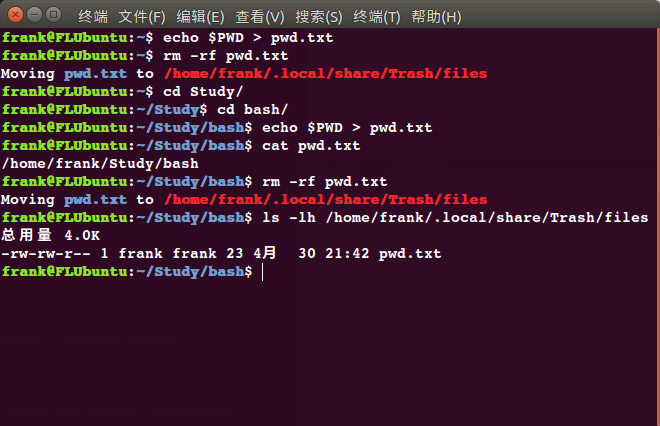
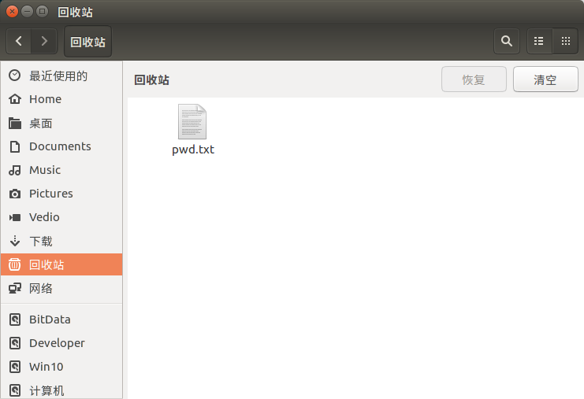
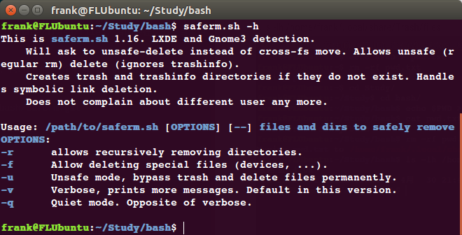

# 给 “rm” 命令添加个“垃圾桶”

### 1 脚本使用说明

人类犯错误是因为我们不是一个可编程设备，所以，在使用 rm 命令时要额外注意，不要在任何时候使用 rm -rf *。当你使用 rm 命令时，它会永久删除文件，不会像文件管理器那样将这些文件移动到 “垃圾箱”。

有时我们会将不应该删除的文件删除掉，所以当错误地删除了文件时该怎么办？ 你必须看看恢复工具（Linux 中有很多数据恢复工具），但我们不知道是否能将它百分之百恢复，所以要如何解决这个问题？

将文件移动到“垃圾桶”是一个好主意，当你无意中运行 rm 命令时，可以拯救你；但是很少有人会说这是一个坏习惯，如果你不注意“垃圾桶”，它可能会在一定的时间内被文件和文件夹堆积起来。在这种情况下，我建议你按照你的意愿去做一个定时任务。

这适用于服务器和桌面两种环境。 如果脚本检测到 GNOME 、KDE、Unity 或 LXDE 桌面环境（DE），则它将文件或文件夹安全地移动到默认垃圾箱 $HOME/.local/share/Trash/files，否则会在您的主目录中创建垃圾箱文件夹 $HOME/Trash。

saferm.sh 脚本托管在 Github 中，可以从仓库中克隆，也可以创建一个名为 saferm.sh 的文件并复制其上的代码。
```
$ git clone https://github.com/flhonker/fl-bash.git
$ sudo mv fl-bash/rm-saferm/saferm.sh /bin
$ rm -Rf fl-bash
```
在 .bashrc 文件中设置别名，
> alias=saferm.sh

执行下面的命令使其生效，
> source ~/.bashrc

一切就绪，现在你可以执行 rm 命令，自动将文件移动到”垃圾桶”，而不是永久删除它们。

### 2 测试例程

测试一下，我们将删除一个名为pwd.txt的文件，里面写入了$PWD(当前文件路径)，命令明确提醒了
> $ rm-rf pwd.txt
> _Moving pwd.txt to /home/frank/.local/share/Trash/files_

也可以通过ls命令或trash-cli进行验证：
> $ ls -lh /home/frank/.local/share/Trash/files


或者我们可以通过文件管理器中的“回收站”界面查看相同的内容。


>**说明：**
>虽然用`rm -rf `命令可以把强制删除的文件放入回收站，但是并无法通过原来回收站的恢复操作从回收站恢复文件，会提示找不到有效路径。可以采用`mv`逆操作的方式恢复。

**注：要了解saferm.sh的其他选项，请查看帮助：**
> saferm.sh -h


